| Protocol | Aries RFC | Description / Purpose | Source | Role in CTS |
|-----------|------------|------------------------|---------|--------------|
| Connection & OOB | RFC 0434 – Out-of-Band Protocol 1.1 | Core mechanism for establishing connections without a prior DID exchange. Required for Ayra Cards’ “trusted channels” and all holder-verifier flows. | https://identity.foundation/aries-rfcs/latest/aip2/0023-did-exchange/ | Major |
| DID Exchange | RFC 0023: DID Exchange Protocol 1.0 | Defines how two agents (Issuer–Holder, or Holder–Verifier) establish a pairwise DID relationship. | https://identity.foundation/aries-rfcs/latest/aip2/0023-did-exchange/ | Major |
| Proof Presentation | RFC 0454 – Present Proof 2.0 | Defines verifiable presentation requests and responses. Central to verifier conformance and First Person Credential use. | https://identity.foundation/aries-rfcs/latest/aip2/0454-present-proof-v2/ | Major |
| JSON-LD Compatibility | RFC 0047 - JSON-LD Compatibility | Establishes how Aries agents support JSON-LD credentials and Linked Data Proofs within AIP 2.0. Ensures CTS reference agents interoperate with W3C VC Data Model v2.0. | https://identity.foundation/aries-rfcs/latest/aip2/0047-json-ld-compatibility/#goal | Major |
| JSON-LD Credential Attachment | RFC 0593 - JSON-LD Credential Attachment format for requesting and issuing credentials | Specifies how JSON-LD credentials are attached in Issue Credential and Present Proof messages. Required for conformance with W3C LD-Proof credentials. | https://identity.foundation/aries-rfcs/latest/aip2/0593-json-ld-cred-attach/ | Major |
| ACKs | RFC 0015 – Acknowledgement Messages | Provides a consistent acknowledgment mechanism for confirming successful completion of messages and protocol steps. Used for validating correct protocol state transitions and message reliability in CTS tests. Protocols may complete successfully without Acks so CTS may “Soft Assert” the Acks. | https://identity.foundation/aries-rfcs/latest/aip2/0015-acks/ | Minor |
| Trust Ping | RFC 0048 – Trust Ping Protocol | Used for connection health checks, verifying trusted channel continuity. | https://identity.foundation/aries-rfcs/latest/aip2/0048-trust-ping/ | Minor |
| Problem Reporting | RFC 0035 – Report Problem Protocol | Ensures consistent error handling, critical for Ayra CTS diagnostics and canonical test validation. | https://identity.foundation/aries-rfcs/latest/aip2/0035-report-problem/ | Minor |

```mermaid
graph LR
  %% =====================
  %% LEGEND (color codes)
  %% =====================
  subgraph LEGEND["Legend (CTS Priority)"]
    L1["MUST be in CTS"]:::must
    L2["SHOULD be in CTS"]:::should
    L3["COULD be in CTS (future/optional)"]:::could
    L4["WON'T be in CTS (out of scope now)"]:::wont
  end

  %% =====================
  %% FOUNDATIONS
  %% =====================
  subgraph BASE["BASE / DIDComm v2.1 Foundations (implicitly used)"]
    A0008["0008 Threading<br/>CTS: soft-assert thid/pthid continuity"]:::should
    A0011["0011 Decorators<br/>CTS: ~timing, ~please_ack, locale (soft)"]:::should
    A0017["0017 Attachments<br/>CTS: ~attach id/mime/base64/json"]:::must
    A0020["0020 Message Types<br/>CTS: PIURI/MTURI correctness (soft)"]:::should
    A0035["0035 Problem Report<br/>CTS: structured failures if present"]:::should
    A0015["0015 ACKs<br/>CTS: soft-assert completion ACKs"]:::should
    A0044["0044 File & MIME Types<br/>CTS: attachment mimeType"]:::should
    A0317["0317 Please-ACK Decorator<br/>CTS: optional explicit ACKs"]:::could
  end

  %% =====================
  %% CONNECTION & CAPABILITY DISCOVERY
  %% =====================
  subgraph CONN["CONNECTION & DISCOVERY (if no prior relationship)"]
    A0434["0434 Out-of-Band 1.1<br/>CTS: INVITE or connection-less service"]:::must
    A0023["0023 DID Exchange 1.0<br/>CTS: pairwise DID channel (if connection-based)"]:::must
    A0048["0048 Trust Ping<br/>CTS: liveness check (soft)"]:::should
    A0557["0557 Discover Features 2.x<br/>CTS: advertise 0454/0593/0047"]:::should
    A0211["0211 Mediator Coordination<br/>CTS: optional routed topologies"]:::could
    A0685["0685 Pickup 2.0<br/>CTS: optional offline pickup/queue"]:::could
  end

  %% =====================
  %% VC FORMAT (W3C JSON-LD) & PROOF
  %% =====================
  subgraph FORMAT["W3C VC (JSON-LD) FORMAT SUPPORT"]
    A0047["0047 JSON-LD Compatibility<br/>CTS: JSON-LD processing & LD-Proofs"]:::must
    A0593["0593 JSON-LD Credential Attachment<br/>CTS: VC/VP payload attach"]:::must
    A0510["0510 Presentation-Exchange Attachments<br/>CTS: constraints → VP mapping"]:::should
  end

  %% =====================
  %% VERIFICATION (PROOF)
  %% =====================
  subgraph PROOF["VERIFICATION (Holder ↔ Verifier)"]
    A0454["0454 Present Proof 2.0<br/>CTS: primary protocol under test"]:::must
  end

  %% =====================
  %% GUIDANCE / POLICY (advisory)
  %% =====================
  subgraph GUIDE["GUIDANCE / POLICY (advisory, not wire)"]
    A0519["0519 Goal Codes<br/>CTS: intent consistency (advisory)"]:::could
    A0441["0441 Best Practices (Present Proof)<br/>CTS: data-min, anti-replay warnings"]:::could
    A0496["0496 Transition to OOB<br/>CTS: documentation traceability"]:::could
  end

  %% =====================
  %% OUT OF SCOPE FOR THIS CTS (explicit)
  %% =====================
  subgraph OUT["EXCLUDED for this CTS (Holder–Verifier JSON-LD only)"]
    A0453["0453 Issue Credential 2.0<br/>Issuance out of scope"]:::wont
    A0592["0592 Indy Attachments<br/>Not used for JSON-LD path"]:::wont
    A0646["0646 BBS+ Exchange<br/>Only if Ayra selects BBS+ later"]:::wont
    A0019["0019 Encryption Envelope (legacy)<br/>Not exercised directly"]:::wont
    A0587["0587 Envelope v2 (removed note)<br/>Skip per AIP2 note"]:::wont
  end

  %% =====================
  %% REVOCATION (future)
  %% =====================
  subgraph REVO["REVOCATION (Future—NOT enforced now)"]
    A0183["0183 Revocation Notification 1.0<br/>COULD: future verifier flow"]:::could
    A0721["0721 Revocation Notification 2.0<br/>COULD: future verifier flow"]:::could
  end

  %% =====================
  %% RELATIONSHIPS (edges with reasons + CTS notes)
  %% =====================

  %% Capability discovery governs proof feature negotiation
  A0557 -- "WHY: learn protocols & formats<br/>CTS: SHOULD list 0454" --> A0454
  A0557 -- "WHY: formats for attachments<br/>CTS: SHOULD list 0593" --> A0593
  A0557 -- "WHY: LD-Proof capability<br/>CTS: SHOULD show 0047" --> A0047

  %% If no prior relationship, bootstrap → connection (or connection-less) → ping → proof
  A0434 -- "WHY: invite OR connection-less service endpoints<br/>CTS: parse URL/QR or service blocks" --> A0023
  A0211 -. "WHY: optional mediator routing<br/>CTS: only when relay used" .- A0023
  A0023 -- "WHY: establish pairwise DID (when connection-based)<br/>CTS: state machine & DIDDocs" --> A0048
  A0048 -- "WHY: liveness before proof (optional)<br/>CTS: SHOULD answer ping" --> A0454
  A0685 -. "WHY: queued proof-requests offline<br/>CTS: optional pickup path" .- A0454

  %% JSON-LD wiring into Present Proof
  A0454 -- "WHY: carry VC/VP as attachments<br/>CTS: validate ~attach id/mime/data" --> A0017
  A0454 -- "WHY: request→constraints→presentation<br/>CTS: descriptor satisfaction" --> A0510
  A0454 -- "WHY: JSON-LD VC/VP payloads<br/>CTS: @context, suite, proof verify (incl. expiry)" --> A0047
  A0454 -- "WHY: specify JSON-LD attachment format<br/>CTS: 0593 params correct" --> A0593

  %% Decorators, threading, types apply across proof exchange
  A0011 -- "WHY: ~timing, ~please_ack, etc.<br/>CTS: decorator correctness (soft)" --> A0454
  A0008 -- "WHY: conversation integrity<br/>CTS: thread continuity (soft)" --> A0454
  A0020 -- "WHY: PIURI/MTURI correct<br/>CTS: type & version (soft)" --> A0454
  A0044 -- "WHY: correct MIME labelling<br/>CTS: application/ld+json, etc." --> A0593

  %% Completion and error handling
  A0454 -- "WHY: happy path completion<br/>CTS: soft-assert ACK (0015)" --> A0015
  A0454 -- "WHY: failures (e.g., unmet constraints, expired VC)<br/>CTS: SHOULD use Problem-Report" --> A0035

  %% ==========
  %% STYLES
  %% ==========
  classDef must fill:#e8f5e9,stroke:#2e7d32,stroke-width:1.8,color:#0b4d1e;
  classDef should fill:#e3f2fd,stroke:#1565c0,stroke-width:1.6,color:#0b3a6a;
  classDef could fill:#f3e8ff,stroke:#6a1b9a,stroke-width:1.4,color:#2e1065,stroke-dasharray:5 3;
  classDef wont fill:#fef2f2,stroke:#b91c1c,stroke-width:1.4,color:#7f1d1d,stroke-dasharray:6 4;
```

