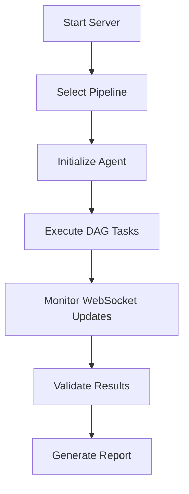

# Ayra Conformance Test Suite

A comprehensive testing framework for digital identity and verifiable credential implementations using the Credo-TS ecosystem. This suite provides standardized conformance tests for **verifier**, **holder**, **issuer**, and **registry** flows in SSI (Self-Sovereign Identity) workflows.

## 🎯 What This Test Suite Does

The Ayra Conformance Test Suite (CTS) enables you to **test your digital wallet or verifier implementation** against standardized SSI protocols. Instead of building complex test harnesses, you can quickly validate that your implementation correctly handles:

- **Connection establishment** via DIDComm protocols
- **Credential issuance** and storage workflows  
- **Proof presentation** and verification processes
- **Registry interactions** for schema and credential definitions

### **Key Value Proposition**
- ⚡ **Quick time to value** - Test your implementation in minutes, not days
- 🌐 **Web portal interface** - No complex setup or backchannel development required
- 📱 **Real device testing** - Test actual mobile wallets and web applications
- 🔄 **Multi-role testing** - Acts as verifier, holder, issuer, or registry as needed

## 🔄 Testing Approaches

### **Current Implementation: Ayra CTS Multi-Role Framework** 🎉

The Ayra CTS now supports **verifier**, **holder**, **issuer**, and **registry** flows in a unified testing framework:

**✅ What's Working:**
- **Verifier role**: Creates invitations, requests proofs, validates presentations
- **Holder role**: Accepts invitations, presents credentials, manages connections  
- **Issuer role**: Issues basic credentials for testing purposes
- **Registry role**: Publishes schemas, manages credential definitions
- **BC Gov Integration**: Successfully tested and validated with BC Government implementations

**⚠️ Current Status:**
- **Functional but brittle** - Core flows work but need maturation
- **Missing components** - Network Credentials and advanced flows not yet implemented
- **Rapid development** - Much quicker time to value than previous approaches

### **Evaluated Approaches (DIDComm/Messaging Focused)**

#### **Legacy: Aries Agent Test Harness**
- ✅ **Pro**: Leveraged extensive existing test infrastructure
- ❌ **Con**: Complex setup requiring vendors to build custom backchannels
- ❌ **Blocker**: Significant barrier to quick testing and adoption

### **Current Credo-Based Testing Approach**

**✅ Advantages:**
- **Uses Credo agents** to test various SSI actors
- **Built on demo app** from previous development cycles
- **Web portal vision** - Eventually deployable as public testing portal
- **Quick time to value** - Much faster than legacy approaches
- **No backchannel development** required for implementers
- **Direct integration** with existing wallet implementations
- **Visual feedback** through web interface

**⚠️ Limitations:**
- **Functional but brittle** - Core flows work but need maturation  
- **Missing components** - Network Credentials and advanced flows not yet implemented
- **Single implementation focus** - Primarily built around Credo-TS ecosystem

## 🏗️ Architecture Overview

### **Package Structure**
```
certification-simple/
├── packages/
│   ├── core/          # Core business logic and agents
│   ├── cts/           # Conformance Test Suite (Next.js frontend + server)
│   └── trqp/          # Test Request/Response Protocol client
├── scripts/           # Python integration scripts
└── tests/            # Jest test configurations
```

### **Major Components**

#### 1. **Core Package** (`@demo/core`)
- **BaseAgent**: Core digital identity agent implementation
- **Task System**: Modular tasks for credential workflows
- **Blockchain Integration**: Cosmos SDK and Cheqd network support
- **Cryptographic Utilities**: Ed25519, AnonCreds support

#### 2. **CTS Package** (`cts-3`)
- **Next.js Frontend**: Web interface for test execution and monitoring
- **Express Server**: API endpoints and WebSocket communication
- **Pipeline System**: DAG-based test execution workflows
- **Real-time Updates**: Socket.IO for live test status

#### 3. **TRQP Package** (`@demo/trqp`)
- **Protocol Client**: Test Request/Response Protocol implementation
- **OpenAPI Integration**: Automated API client generation
- **Test Communication**: Standardized messaging between test components

## 🚀 Quick Start

### **Prerequisites**
- **Node.js** 18+
- **pnpm** 9.1.0+
- **NGROK Account & Auth Token** - Required for external connectivity
  - Sign up at [ngrok.com](https://ngrok.com)
  - Get your auth token from [dashboard](https://dashboard.ngrok.com/get-started/your-authtoken)
- **Docker** (optional, for containerized deployment)

### **Installation**
```bash
# Clone and install dependencies
git clone <repository>
cd certification-simple
pnpm install

# Build all packages
pnpm build

# Validate setup
pnpm validate
```

### **Development Mode**
```bash
# Set your NGROK token
export NGROK_AUTH_TOKEN=your_token_here

# Terminal 1: Start the backend server
cd packages/cts
npm run start:server

# Terminal 2: Start the frontend (optional)
cd packages/cts  
npm run start:frontend

# Terminal 3: Run tests
npm run test-all
```

### **Production Deployment**
```bash
# Build for production
pnpm build

# Start server
cd packages/cts
npm run start:server
```

## 🐳 Docker Deployment

### **Using Docker Compose** (Recommended)
```bash
# Set environment variables
export NGROK_AUTH_TOKEN=your_token_here

# Build and start all services
docker-compose up --build

# Background execution
docker-compose up -d --build

# View logs
docker-compose logs -f

# Stop services
docker-compose down
```

### **Manual Docker Build**
```bash
# Build image
docker build -t conformance-test-suite .

# Run server only
docker run -p 5005:5005 -e NODE_ENV=production conformance-test-suite

# Run with frontend
docker run -p 3000:3000 -p 5005:5005 conformance-test-suite
```

### **Environment Variables**
```bash
# Required: NGROK token for external connectivity
USE_NGROK=true
NGROK_AUTH_TOKEN=your_ngrok_token_here

# Server Configuration
SERVER_PORT=5005           # API server port
AGENT_PORT=5006           # Agent service port
NODE_ENV=production        # Environment mode
API_URL=http://localhost:5005  # Base API URL

# Optional: Wallet storage
WALLET_STORAGE_PATH=./data/wallets  # Wallet storage location
```

## 🧪 Testing Framework

### **Test Types**

#### **1. HolderTest Pipeline**
Tests verifier functionality (creates invitations, requests proofs):
```bash
npm run test-holder
```
**Validates:**
- QR code generation
- Connection establishment  
- Proof request creation
- Response handling

#### **2. VerifierTest Pipeline**
Tests holder functionality (responds to invitations, provides proofs):
```bash
npm run test-verifier
```
**Validates:**
- Invitation parsing
- DIDComm connections
- Proof presentation
- Credential selection

#### **3. Integration Testing**
End-to-end workflow validation:
```bash
npm run test-integration
# or
npm run test-all
```

### **Test Execution Flow**


### **API Endpoints**
- `GET /api/health` - Server health check
- `GET /api/dag` - Current DAG state
- `GET /api/select/pipeline?pipeline=HOLDER_TEST` - Select test pipeline
- `POST /api/run` - Execute selected pipeline
- `GET /api/invitation` - Get current invitation URL

## 📊 Test Scenarios

### **Credential Issuance Flow**
1. Issuer creates credential definition
2. Holder requests credential
3. Issuer issues credential to holder
4. Holder stores credential in wallet

### **Proof Presentation Flow**  
1. Verifier creates proof request
2. Verifier generates invitation QR code
3. Holder scans invitation and connects
4. Holder receives proof request
5. Holder presents matching credentials
6. Verifier validates proof and credentials

### **Supported Standards**
- **DIDComm v2**: Secure messaging protocol
- **AnonCreds**: Privacy-preserving credentials
- **OpenID Connect**: OAuth 2.0 extension
- **W3C Verifiable Credentials**: Standard credential format
- **DID Core**: Decentralized identifier specification

## 🔧 Development Guidelines

### **Code Structure**
```typescript
// Task-based architecture
class SetupConnectionTask extends Task {
  async execute(): Promise<void> {
    // Connection logic
  }
}

// Pipeline composition
class HolderTestPipeline extends Pipeline {
  createDAG(): DAG {
    return new DAG([
      new SetupConnectionTask(),
      new RequestProofTask(),
      new EvaluateResponseTask()
    ]);
  }
}
```

### **Adding New Tests**
1. Create task in `packages/core/agent/tasks/`
2. Add pipeline in `packages/cts/server/pipelines/`
3. Update test scripts in `packages/cts/scripts/`
4. Add validation in test suite

### **Configuration Management**
```typescript
// Agent configuration
const config = createAgentConfig(
  "Test Agent",
  port,
  agentId, 
  publicUrl,
  endpoints
);

const agent = new BaseAgent(config);
await agent.init();
```

## 🚧 Known Issues & TODOs

### **Current Limitations**
- [ ] **Persistence**: No database integration for test results
- [ ] **Metrics**: Limited performance monitoring
- [ ] **Scalability**: Single-agent architecture
- [ ] **Mobile Testing**: No native mobile wallet integration
- [ ] **Error Recovery**: Limited retry mechanisms

### **Security Considerations**
- [ ] **Key Management**: Implement proper key rotation
- [ ] **Transport Security**: Add TLS/SSL configuration
- [ ] **Access Control**: Implement authentication/authorization
- [ ] **Input Validation**: Enhance request validation
- [ ] **Rate Limiting**: Add API rate limiting

### **Performance Improvements**
- [ ] **Caching**: Implement Redis caching layer
- [ ] **Load Balancing**: Add multiple agent instances
- [ ] **Monitoring**: Integrate Prometheus metrics
- [ ] **Logging**: Structured logging with correlation IDs

### **Feature Enhancements**
- [ ] **Test Reports**: Generate detailed HTML reports
- [ ] **CI/CD Integration**: GitHub Actions workflows
- [ ] **Real Wallet Testing**: Mobile wallet connectors
- [ ] **Compliance Testing**: Regulatory compliance checks
- [ ] **Interoperability**: Cross-platform testing matrix

## 📈 Monitoring & Debugging

### **WebSocket Events**
```javascript
// Real-time test monitoring
socket.on('dag-state-update', (data) => {
  console.log('Pipeline status:', data.dagState.status);
  console.log('Task states:', data.nodeStates);
});

socket.on('invitation', (url) => {
  console.log('New invitation:', url);
});
```

### **Log Analysis**
```bash
# Server logs
tail -f packages/cts/server.log

# Agent logs  
tail -f packages/core/agent.log

# Debug mode
DEBUG=true npm run test-holder
```

### **Health Monitoring**
```bash
# Check server health
curl http://localhost:5005/api/health

# Monitor DAG state
curl http://localhost:5005/api/dag
```

## 🤝 Contributing

### **Development Setup**
```bash
# Fork repository
git clone <your-fork>
cd certification-simple

# Create feature branch
git checkout -b feature/your-feature

# Install dependencies
pnpm install

# Run tests
pnpm test

# Submit PR
git push origin feature/your-feature
```

### **Code Quality**
- **TypeScript**: Strict type checking enabled
- **ESLint**: Consistent code formatting
- **Prettier**: Automated code formatting
- **Jest**: Unit and integration testing

### **Testing Requirements**
- All new features must include tests
- Minimum 80% code coverage
- Integration tests for API endpoints
- E2E tests for user workflows

## 📚 Additional Resources

- **[Credo-TS Documentation](https://docs.credo.tech/)** - Core framework docs
- **[DIDComm Specification](https://identity.foundation/didcomm-messaging/spec/)** - Messaging protocol
- **[AnonCreds Specification](https://anoncreds-wg.github.io/anoncreds-spec/)** - Privacy-preserving credentials
- **[Hyperledger Indy](https://hyperledger.github.io/indy-sdk/)** - Blockchain integration

## 📄 License

Licensed under the Apache License 2.0. See [LICENSE](LICENSE) for details.

## 📞 Support

- **Issues**: [GitHub Issues](https://github.com/your-repo/issues)
- **Discussions**: [GitHub Discussions](https://github.com/your-repo/discussions)
- **Documentation**: [Wiki](https://github.com/your-repo/wiki)