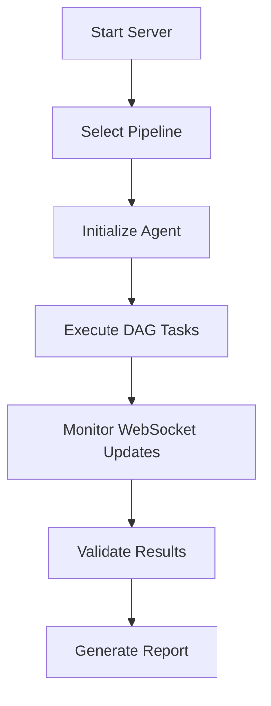

# Ayra Conformance Test Suite

A testing framework that validates digital wallet and verifier implementations for participation in the **Ayra Trust Network**. The Ayra CTS ensures your SSI implementation correctly interoperates with the network's standards for verifiable credentials, decentralized identifiers, and secure messaging protocols.

## 🎯 What This Test Suite Does

The Ayra Conformance Test Suite validates that your implementation can **successfully participate in the Ayra Trust Network** by testing compliance with:

- **Network connection protocols** for joining the trust network
- **Credential issuance standards** used across network participants  
- **Proof presentation formats** accepted by network verifiers
- **Registry interaction patterns** for schema and credential definition publishing
- **Trust framework compliance** ensuring adherence to network governance

### **Ayra Trust Network Participation**
The CTS specifically tests your ability to:
- ✅ **Connect to network nodes** using standard DIDComm protocols
- ✅ **Issue network-compatible credentials** following Ayra schemas
- ✅ **Present proofs** in formats accepted by network verifiers
- ✅ **Publish to network registries** with proper authorization
- ✅ **Maintain trust relationships** according to network governance

### **Value for Network Participants**
- ⚡ **Fast network onboarding** - Validate readiness for Ayra Trust Network in minutes
- 🌐 **Pre-deployment validation** - Test compliance before going live on the network
- 📱 **Real device compatibility** - Ensure mobile wallets work with network standards
- 🔄 **Multi-role certification** - Validate as issuer, holder, verifier, or registry operator
- 🏛️ **Governance compliance** - Verify adherence to network trust framework

## 🔄 Testing Approaches

### **Current Implementation: Ayra Trust Network Validation** 🎉

The Ayra CTS validates network participation readiness across all participant roles:

**✅ Network Compliance Testing:**
- **Network Verifier**: Creates Ayra-compliant invitations, requests proofs following network schemas
- **Network Holder**: Accepts network invitations, presents credentials in network-approved formats  
- **Network Issuer**: Issues credentials using Ayra Trust Network schemas and governance
- **Network Registry**: Publishes schemas and credential definitions to network registries
- **Production Validation**: Successfully tested with BC Government and other network participants

**⚠️ Current Development Status:**
- **Functional for network onboarding** - Core network participation flows validated
- **Rapid iteration** - Continuously updated based on network participant feedback
- **Missing advanced features** - Some complex network scenarios still in development

### **Evaluated Approaches (DIDComm/Messaging Focused)**

#### **Legacy: Aries Agent Test Harness**
- ✅ **Pro**: Leveraged extensive existing test infrastructure
- ❌ **Con**: Complex setup requiring vendors to build custom backchannels
- ❌ **Blocker**: Significant barrier to quick testing and adoption

### **Current Credo-Based Testing Approach**

**✅ Advantages:**
- **Network-specific validation** - Tests actual Ayra Trust Network compliance
- **Built on production experience** - Leverages real deployment learnings
- **Web-based testing portal** - Accessible to any network participant
- **Fast network readiness validation** - Rapid pre-deployment verification
- **No custom integration required** - Standard implementations work immediately
- **Real network compatibility** - Tests against actual network standards
- **Visual compliance feedback** - Clear pass/fail indicators for network requirements

**⚠️ Current Limitations:**
- **Active development** - Network standards evolving, requiring frequent updates  
- **Limited advanced scenarios** - Complex multi-party workflows still being added
- **Credo-TS focused** - Primarily optimized for Credo-based implementations

## 🏗️ Architecture Overview

### **Package Structure**
```
certification-simple/
├── packages/
│   ├── core/          # Core business logic and agents
│   ├── cts/           # Conformance Test Suite (Next.js frontend + server)
│   └── trqp/          # Test Request/Response Protocol client
├── scripts/           # Python integration scripts
└── tests/            # Jest test configurations
```

### **Major Components**

#### 1. **Core Package** (`@demo/core`)
- **BaseAgent**: Core digital identity agent implementation
- **Task System**: Modular tasks for credential workflows
- **Blockchain Integration**: Cosmos SDK and Cheqd network support
- **Cryptographic Utilities**: Ed25519, AnonCreds support

#### 2. **CTS Package** (`cts`)
- **Next.js Frontend**: Web interface for test execution and monitoring
- **Express Server**: API endpoints and WebSocket communication
- **Pipeline System**: DAG-based test execution workflows
- **Real-time Updates**: Socket.IO for live test status

#### 3. **TRQP Package** (`@demo/trqp`)
- **Protocol Client**: Test Request/Response Protocol implementation
- **OpenAPI Integration**: Automated API client generation
- **Test Communication**: Standardized messaging between test components

## 🚀 Quick Start

### **Prerequisites**
- **Node.js** 18+
- **pnpm** 9.1.0+
- **NGROK Account & Auth Token** - Required for external connectivity
  - Sign up at [ngrok.com](https://ngrok.com)
  - Get your auth token from [dashboard](https://dashboard.ngrok.com/get-started/your-authtoken)
- **Docker** (optional, for containerized deployment)

### **Installation**
```bash
# Clone and install dependencies
git clone <repository>
cd certification-simple
pnpm install

# Build all packages
pnpm build

# Validate setup
pnpm validate
```

### **Development Mode**
```bash
# Set your NGROK token
export NGROK_AUTH_TOKEN=your_token_here

# Terminal 1: Start the backend server
cd packages/cts
npm run start:server

# Terminal 2: Start the frontend (optional)
cd packages/cts  
npm run start:frontend

# Terminal 3: Run tests
npm run test-all
```

### **Production Deployment**
```bash
# Build for production
pnpm build

# Start server
cd packages/cts
npm run start:server
```

## 🐳 Docker Deployment

### **Using Docker Compose** (Recommended)
```bash
# Set environment variables
export NGROK_AUTH_TOKEN=your_token_here

# Build and start all services
docker-compose up --build

# Background execution
docker-compose up -d --build

# View logs
docker-compose logs -f

# Stop services
docker-compose down
```

### **Manual Docker Build**
```bash
# Build image
docker build -t conformance-test-suite .

# Run server only
docker run -p 5005:5005 -e NODE_ENV=production conformance-test-suite

# Run with frontend
docker run -p 3000:3000 -p 5005:5005 conformance-test-suite
```

### **Environment Variables**
```bash
# Required: NGROK token for external connectivity
USE_NGROK=true
NGROK_AUTH_TOKEN=your_ngrok_token_here

# Server Configuration
SERVER_PORT=5005           # API server port
AGENT_PORT=5006           # Agent service port
NODE_ENV=production        # Environment mode
API_URL=http://localhost:5005  # Base API URL

# Optional: Wallet storage
WALLET_STORAGE_PATH=./data/wallets  # Wallet storage location
```

## 🧪 Testing Framework

### **Test Types**

#### **1. HolderTest Pipeline**
Tests verifier functionality (creates invitations, requests proofs):
```bash
npm run test-holder
```
**Validates:**
- QR code generation
- Connection establishment  
- Proof request creation
- Response handling

#### **2. VerifierTest Pipeline**
Tests holder functionality (responds to invitations, provides proofs):
```bash
npm run test-verifier
```
**Validates:**
- Invitation parsing
- DIDComm connections
- Proof presentation
- Credential selection

#### **3. Integration Testing**
End-to-end workflow validation:
```bash
npm run test-integration
# or
npm run test-all
```

### **Test Execution Flow**


### **API Endpoints**
- `GET /api/health` - Server health check
- `GET /api/dag` - Current DAG state
- `GET /api/select/pipeline?pipeline=HOLDER_TEST` - Select test pipeline
- `POST /api/run` - Execute selected pipeline
- `GET /api/invitation` - Get current invitation URL

## 📊 Network Compliance Testing

### **Ayra Trust Network Validation Scenarios**

#### **Network Onboarding Flow**
1. Participant registers with network registry
2. Implementation requests network connection 
3. CTS validates compliance with network protocols
4. Participant receives network participation certificate

#### **Cross-Network Credential Exchange**  
1. Network issuer creates credential using Ayra schemas
2. Network holder receives and stores credential
3. External verifier requests proof via network protocols
4. CTS validates proper network-compliant proof presentation

#### **Trust Framework Compliance**
- **Governance adherence** - Validates compliance with Ayra Trust Framework
- **Schema validation** - Ensures credentials follow network-approved schemas
- **Authorization flows** - Tests proper network permission models
- **Audit trail compliance** - Verifies required network logging and reporting

### **Supported Network Standards**
- **Ayra Trust Framework**: Network governance and trust model compliance
- **DIDComm v2**: Secure messaging protocol for network communication
- **AnonCreds**: Privacy-preserving credentials within network
- **Ayra Schema Registry**: Network-approved credential schemas
- **Network Authorization**: Ayra-specific permission and access control
- **W3C VC Compliance**: Verifiable Credentials following network profiles

## 🔧 Development Guidelines

### **Code Structure**
```typescript
// Task-based architecture
class SetupConnectionTask extends Task {
  async execute(): Promise<void> {
    // Connection logic
  }
}

// Pipeline composition
class HolderTestPipeline extends Pipeline {
  createDAG(): DAG {
    return new DAG([
      new SetupConnectionTask(),
      new RequestProofTask(),
      new EvaluateResponseTask()
    ]);
  }
}
```

### **Adding New Tests**
1. Create task in `packages/core/agent/tasks/`
2. Add pipeline in `packages/cts/server/pipelines/`
3. Update test scripts in `packages/cts/scripts/`
4. Add validation in test suite

### **Configuration Management**
```typescript
// Agent configuration
const config = createAgentConfig(
  "Test Agent",
  port,
  agentId, 
  publicUrl,
  endpoints
);

const agent = new BaseAgent(config);
await agent.init();
```

## 🚧 Known Issues & TODOs

### **Ayra Trust Network Requirements**
- [ ] **Network Certification Process**: Formal certification workflow for network participation
- [ ] **Governance Compliance Validation**: Automated checks against Ayra Trust Framework policies
- [ ] **Network Node Registration**: Integration with official Ayra network registry
- [ ] **Trust Anchor Validation**: Verification against approved network trust anchors
- [ ] **Network Schema Compliance**: Real-time validation against current Ayra schema registry

### **Current Limitations**
- [ ] **Persistence**: No database integration for test results
- [ ] **Metrics**: Limited performance monitoring
- [ ] **Scalability**: Single-agent architecture
- [ ] **Mobile Testing**: No native mobile wallet integration
- [ ] **Error Recovery**: Limited retry mechanisms

### **Security Considerations**
- [ ] **Key Management**: Implement proper key rotation
- [ ] **Transport Security**: Add TLS/SSL configuration
- [ ] **Access Control**: Implement authentication/authorization
- [ ] **Input Validation**: Enhance request validation
- [ ] **Rate Limiting**: Add API rate limiting

### **Performance Improvements**
- [ ] **Caching**: Implement Redis caching layer
- [ ] **Load Balancing**: Add multiple agent instances
- [ ] **Monitoring**: Integrate Prometheus metrics
- [ ] **Logging**: Structured logging with correlation IDs

### **Feature Enhancements**
- [ ] **Test Reports**: Generate detailed HTML reports
- [ ] **CI/CD Integration**: GitHub Actions workflows
- [ ] **Real Wallet Testing**: Mobile wallet connectors
- [ ] **Compliance Testing**: Regulatory compliance checks
- [ ] **Interoperability**: Cross-platform testing matrix

## 📈 Monitoring & Debugging

### **WebSocket Events**
```javascript
// Real-time test monitoring
socket.on('dag-state-update', (data) => {
  console.log('Pipeline status:', data.dagState.status);
  console.log('Task states:', data.nodeStates);
});

socket.on('invitation', (url) => {
  console.log('New invitation:', url);
});
```

### **Log Analysis**
```bash
# Server logs
tail -f packages/cts/server.log

# Agent logs  
tail -f packages/core/agent.log

# Debug mode
DEBUG=true npm run test-holder
```

### **Health Monitoring**
```bash
# Check server health
curl http://localhost:5005/api/health

# Monitor DAG state
curl http://localhost:5005/api/dag
```

## 🤝 Contributing

### **Development Setup**
```bash
# Fork repository
git clone <your-fork>
cd certification-simple

# Create feature branch
git checkout -b feature/your-feature

# Install dependencies
pnpm install

# Run tests
pnpm test

# Submit PR
git push origin feature/your-feature
```

### **Code Quality**
- **TypeScript**: Strict type checking enabled
- **ESLint**: Consistent code formatting
- **Prettier**: Automated code formatting
- **Jest**: Unit and integration testing

### **Testing Requirements**
- All new features must include tests
- Minimum 80% code coverage
- Integration tests for API endpoints
- E2E tests for user workflows

## 📚 Additional Resources

- **[Credo-TS Documentation](https://docs.credo.tech/)** - Core framework docs
- **[DIDComm Specification](https://identity.foundation/didcomm-messaging/spec/)** - Messaging protocol
- **[AnonCreds Specification](https://anoncreds-wg.github.io/anoncreds-spec/)** - Privacy-preserving credentials
- **[Hyperledger Indy](https://hyperledger.github.io/indy-sdk/)** - Blockchain integration

## 📄 License

Licensed under the Apache License 2.0. See [LICENSE](LICENSE) for details.

## 📞 Support

- **Issues**: [GitHub Issues](https://github.com/your-repo/issues)
- **Discussions**: [GitHub Discussions](https://github.com/your-repo/discussions)
- **Documentation**: [Wiki](https://github.com/your-repo/wiki)