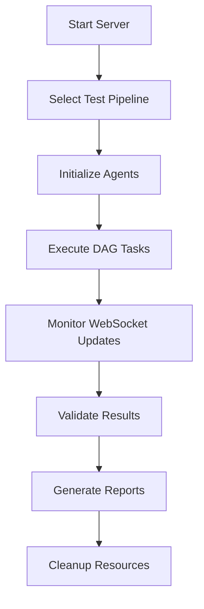

# Conformance Test Suite (CTS) Package

A Next.js-based web application for testing digital identity implementations' compliance with Ayra Trust Network standards. This package provides both frontend interface and server-side testing infrastructure for validating SSI (Self-Sovereign Identity) implementations.

## 📦 What's in This Package

The CTS package contains a complete testing environment with:

### **Frontend Application** (`src/`)
- **Next.js 15 Web Interface**: Modern React application for test execution and monitoring
- **Real-time Updates**: Socket.IO integration for live test status updates
- **Test Dashboards**: Visual interfaces for Holder, Verifier, Issuer, and Registry testing
- **QR Code Generation**: Dynamic invitation QR codes for mobile wallet testing
- **Results Reporting**: Comprehensive test result visualization and analysis

### **Backend Server** (`server/`)
- **Express.js API Server**: RESTful API endpoints for test management
- **Task Pipeline System**: DAG-based test execution with real-time monitoring
- **WebSocket Server**: Socket.IO server for real-time communication
- **Test Orchestration**: Automated test pipeline management and execution

### **Test Scripts** (`scripts/`)
- **Automated Test Runners**: Programmatic test execution scripts
- **Integration Testing**: End-to-end test validation
- **CLI Test Interface**: Command-line test execution capabilities

## 🏗️ Repository Architecture Overview

This package is the Certification-Simple stack: a monolithic Next.js application with an integrated Express backend, task pipelines, and direct Credo-TS integration. It is the maintained production baseline for Ayra CTS.

**Current coverage**
- ✅ TRQP trust registry checks
- ✅ Holder conformance flow
- ✅ Issue flow (utility flow)
- ✅ Credential format: AnonCreds
- 🚧 Verifier conformance flow (in progress)
- 🚧 Credential format: W3C LDP (in progress)

## 🚀 Quick Start

### **Prerequisites**
- **Node.js 18+**
- **pnpm 9.1.0+**
- **NGROK Account** (for external connectivity)
- For docker-compose and `.env` based NGROK configuration, refer to [`../NGROK_SETUP.md`](../NGROK_SETUP.md).

### **Installation & Setup**
```bash
# From the certification-simple root directory
cd packages/cts

# Install dependencies
pnpm install

# Build the application
pnpm build

# Set NGROK authentication token
export NGROK_AUTH_TOKEN=your_token_here
```

### **Development Mode**
```bash
# Terminal 1: Start the backend server
npm run start:server

# Terminal 2: Start the frontend development server (optional)
npm run dev

# Terminal 3: Run tests
npm run test-all
```

### **Production Mode**
```bash
# Build for production
npm run build

# Start the production server
npm run start:server
```

### **Docker Deployment**
```bash
# Using Docker Compose (from project root)
export NGROK_AUTH_TOKEN=your_token_here
docker-compose up --build

# Using direct Docker
docker build -t cts-package .
docker run -p 5005:5005 -e NGROK_AUTH_TOKEN=your_token_here cts-package
```

### **Dev Container (with ACA-Py sidecar)**
- Ensure Docker is running, then open the repo in VS Code and “Reopen in Container” (uses `.devcontainer/devcontainer.json`). This brings up the `dev` container and the `acapy-control` sidecar.
- Inside the dev container:
  - Start API: `pnpm --filter cts-3 start:server`
  - Start frontend: `pnpm --filter cts-3 dev`
  - Run Ayra schema validation: `npm run validate:ayra-card-context -- --sample schema/example-ayra-card.json --context schema/AyraBusinessCardV1R0.jsonld --context-url https://schema.affinidi.io/AyraBusinessCardV1R0.jsonld`
  - ACA-Py admin endpoint (default): `http://acapy-control:9001`

## 🧪 Testing Framework

### **Available Test Types**

#### **Ayra Card Context/Schema Validation** (`npm run validate:ayra-card-context`)
Validates that the Ayra Card JSON Schema, JSON-LD context, and (optionally) a sample credential align before running DIDComm flows.
- Defaults target `schema/ayra-card-business-card-schema.json` and `schema/example-ayra-card.json` from the upstream Ayra repo.
- Provide a JSON-LD context file if available (for example `schema/AyraBusinessCardV1R0.jsonld` or place it in `public/contexts/`).
- Enforce the expected context URL with `--context-url` (e.g., `https://schema.affinidi.io/AyraBusinessCardV1R0.jsonld` or your local host).
- Example: `npm run validate:ayra-card-context -- --sample schema/example-ayra-card.json --context schema/AyraBusinessCardV1R0.jsonld --context-url https://schema.affinidi.io/AyraBusinessCardV1R0.jsonld`

#### **1. Holder Testing** (`npm run test-holder`)
Tests verifier functionality by creating connection invitations and proof requests:

```bash
npm run test-holder
```

**Validates**:
- QR code generation and format
- Connection invitation creation
- Proof request generation
- Response handling and evaluation

#### **2. Verifier Testing** (`npm run test-verifier`)
Tests holder functionality using real Credo agents:

```bash
npm run test-verifier
```

**Validates**:
- Invitation acceptance and parsing
- DIDComm connection establishment
- Proof request processing
- Credential presentation generation

#### **3. Integration Testing** (`npm run test-all`)
Complete end-to-end workflow validation:

```bash
npm run test-integration
# or
npm run test-all
```

**Validates**:
- Full holder-verifier interaction
- Multi-agent coordination
- Complete credential workflows

### **Trust Registry (TRQP) Conformance**

- **Core checks**: Uses TRQP `POST /authorization` and `POST /recognition` (entity_id, authority_id, action, resource, optional context). Ayra extension API tests (metadata/lookups) run separately.
- **Holder flow mapping**: Derives TRQP payloads from the presented VC (entity_id=issuer.id, authority_id=credentialSubject.ecosystem_id, action=issue, resource=ayracard:<card_type>; recognition uses entity_id=ecosystem_id, authority_id=ayra_trust_network_did, action=member-of, resource=ayratrustnetwork, context.time=issuance time) and resolves the TRQP endpoint from the ecosystem DID.
- **Configuration**: Set a resolver (`NEXT_PUBLIC_DID_RESOLVER_URL`) or bypass with a known TRQP endpoint (`NEXT_PUBLIC_TRQP_KNOWN_ENDPOINT`). Dev override via `NEXT_PUBLIC_TRQP_LOCAL_URL`.
- **Env location**: TRQP env keys live in `packages/cts/.env.local` (also listed in the root `.env.example` and synced from `NEXT_PUBLIC_*` in the root `.env` on dev/build/start).

### **Test Execution Flow**



### **API Endpoints**

| Endpoint | Method | Description |
|----------|--------|-------------|
| `/api/health` | GET | Server health check |
| `/api/dag` | GET | Current DAG state |
| `/api/select/pipeline` | GET | Select test pipeline |
| `/api/run` | POST | Execute selected pipeline |
| `/api/invitation` | GET | Get current invitation URL |

## 📱 Web Interface

### **Available Test Pages**

#### **Holder Test** (`/holder`)
Interactive interface for testing wallet holder capabilities:
- Connection establishment
- Credential reception
- Proof presentation

#### **Verifier Test** (`/verifier`)
Interface for testing verifier implementations:
- Invitation generation
- Proof request creation
- Response validation

#### **Issuer Test** (`/issuer`)
Credential issuance testing interface:
- Credential definition creation
- Credential issuance workflows
- Revocation testing

#### **Registry Test** (`/registry`)
Trust registry interaction testing:
- Schema publication
- Credential definition registration
- Registry query operations

### **Real-time Monitoring**

The web interface provides real-time updates through WebSocket connections:

```javascript
// Example WebSocket event handling
socket.on('dag-state-update', (data) => {
  console.log('Pipeline status:', data.dagState.status);
  console.log('Task progress:', data.nodeStates);
});

socket.on('invitation', (url) => {
  console.log('New invitation generated:', url);
});
```

## 🔧 Configuration

### **Environment Variables**

Set these values in `certification-simple/.env` (preferred) or export them in your shell before running docker compose/npm scripts:

```bash
# Required
NGROK_AUTH_TOKEN=your_ngrok_token_here   # NGROK authentication

# Server Configuration
SERVER_PORT=5005                          # API server port
AGENT_PORT=5006                          # Agent service port
NODE_ENV=production                      # Environment mode

# Optional
USE_NGROK=true                           # Enable NGROK tunneling
API_URL=http://localhost:5005            # Base API URL
WALLET_STORAGE_PATH=./data/wallets       # Wallet storage location
```

### **Agent Configuration**

```typescript
// Example agent configuration
const config = createAgentConfig(
  "Test Agent",
  port,
  agentId,
  publicUrl,
  endpoints
);

const agent = new BaseAgent(config);
await agent.init();
```

## 📊 Test Results & Reporting

### **Success Indicators**
- ✅ **Socket Connection**: WebSocket connectivity established
- ✅ **DAG Updates**: Real-time test progress updates received
- ✅ **Invitation Generation**: Valid invitation URLs created
- ✅ **Connection Establishment**: DIDComm connections successfully created
- ✅ **Credential Exchange**: Successful credential issuance and presentation

### **Common Failure Scenarios**
- ❌ **Server Not Running**: Ensure backend server is started
- ❌ **Socket Timeout**: Check WebSocket connection and server logs
- ❌ **Invalid Invitations**: Verify invitation URL format and content
- ❌ **Agent Initialization**: Check wallet configuration and dependencies
- ❌ **NGROK Tunnel Conflicts**: Follow the troubleshooting steps in [`../NGROK_SETUP.md`](../NGROK_SETUP.md) when you encounter `ERR_NGROK_334` or duplicate tunnel errors.

## 🛠️ Development Guidelines

### **Adding New Tests**

1. **Create Task Class**:
   ```typescript
   // server/tasks/customTask.ts
   class CustomTask extends Task {
     async execute(): Promise<void> {
       // Custom test logic
     }
   }
   ```

2. **Create Pipeline**:
   ```typescript
   // server/pipelines/customPipeline.ts
   class CustomPipeline extends Pipeline {
     createDAG(): DAG {
       return new DAG([
         new CustomTask(),
         // Additional tasks
       ]);
     }
   }
   ```

3. **Add Frontend Interface**:
   ```typescript
   // src/pages/custom.tsx
   export default function CustomTest() {
     // React component for test interface
   }
   ```

### **Code Structure**

```
packages/cts/
├── src/                 # Frontend React application
│   ├── pages/          # Next.js pages and API routes
│   ├── components/     # React components
│   ├── services/       # API and business logic
│   └── store/          # Redux state management
├── server/             # Backend Express server
│   ├── pipelines/      # Test pipeline definitions
│   ├── tasks/          # Individual test tasks
│   └── api.ts          # API route handlers
├── scripts/            # Automated test scripts
└── public/             # Static assets
```

## 🏃‍♂️ How to Run

### **1. Basic Test Execution**
```bash
# Start the server
npm run start:server

# In another terminal, run tests
npm run test-all
```

### **2. Web Interface Testing**
```bash
# Start server with web interface
npm run start:server

# Open browser to http://localhost:5005
# Navigate to desired test page (/holder, /verifier, etc.)
```

### **3. Custom Test Scripts**
```bash
# Run specific test scenarios
npm run test-holder     # Test holder functionality
npm run test-verifier   # Test verifier functionality
npm run test-integration  # Full integration tests
```

### **4. Docker Deployment**
```bash
# Using Docker Compose
docker-compose up --build

# Access web interface at http://localhost:3000
# API available at http://localhost:5005
```

## 🔍 Monitoring & Debugging

### **Log Analysis**
```bash
# Server logs
tail -f server.log

# Debug mode
DEBUG=true npm run start:server
```

### **Health Monitoring**
```bash
# Check server health
curl http://localhost:5005/api/health

# Monitor DAG state
curl http://localhost:5005/api/dag
```

### **WebSocket Events**
```javascript
// Monitor real-time events
socket.on('dag-state-update', (data) => {
  console.log('Test progress:', data);
});
```

## 🤝 Contributing

### **Development Setup**
```bash
# Fork and clone repository
git clone <your-fork>
cd certification-simple/packages/cts

# Install dependencies
pnpm install

# Create feature branch
git checkout -b feature/your-feature

# Run tests
npm run test-all
```

### **Code Quality Standards**
- **TypeScript**: Strict type checking
- **ESLint**: Code quality and consistency
- **Prettier**: Automated formatting
- **Jest**: Unit and integration testing

## 📚 Additional Resources

- **[Credo-TS Documentation](https://docs.credo.tech/)**: Core framework documentation
- **[DIDComm Specification](https://identity.foundation/didcomm-messaging/spec/)**: Messaging protocol specification
- **[AnonCreds Specification](https://anoncreds-wg.github.io/anoncreds-spec/)**: Privacy-preserving credentials
- **[Next.js Documentation](https://nextjs.org/docs)**: Frontend framework documentation

## 📄 License

Licensed under the Apache License 2.0. See [LICENSE](../../LICENSE) for details.
